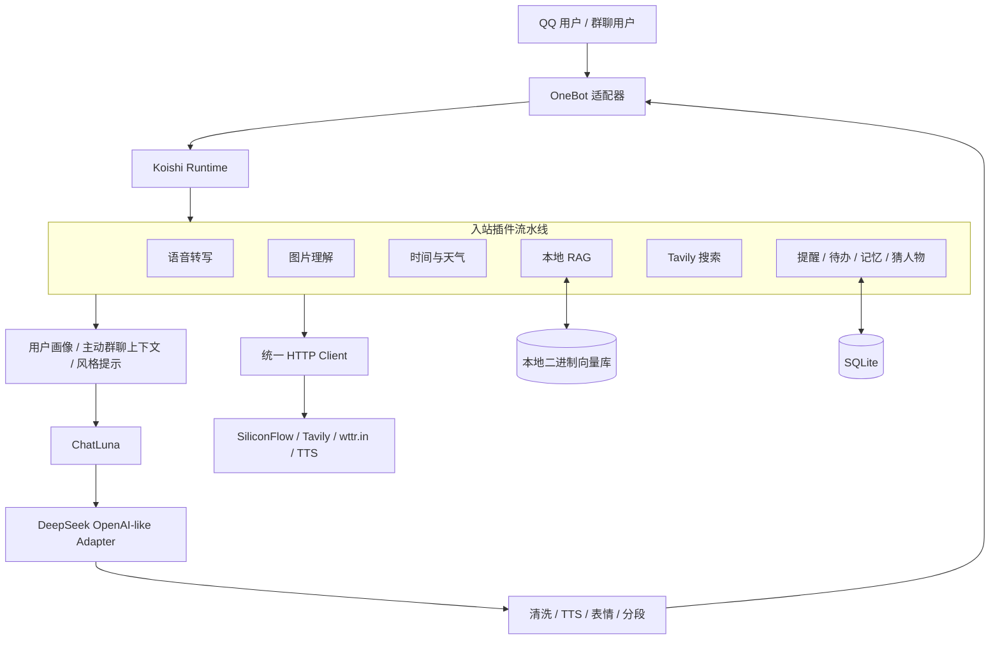
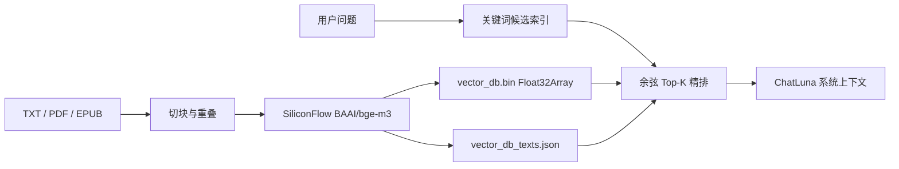

# Arcueid Koishi Assistant

一个以 [Koishi](https://koishi.chat/) 为运行时、以 ChatLuna 为对话编排层的角色化 QQ AI 助手。项目以 QQ / OneBot 为主接入，组合了多模态输入、长期状态、检索增强、主动群聊约束和面向聊天场景的出站渲染。

> 这是一个可自行部署的单实例项目，而不是通用 SaaS。运行时数据、私聊/群聊内容、媒体、向量库和 `.env` 都不在仓库中。查看 [Security and Privacy](SECURITY.md) 了解数据边界。

## 核心能力

- **插件化对话流水线**：在 Koishi 中组合语音、视觉、环境感知、RAG、搜索、提醒、记忆与角色对话。
- **可控状态层**：SQLite 持久化提醒、待办、长期记忆和白名单用户画像；按用户、频道、平台和机器人实例隔离。
- **轻量本地 RAG**：二进制 `Float32Array` 向量库、断点导入、查询缓存、关键词候选裁剪和余弦精排。
- **可靠外部调用**：统一超时、有限重试、指数退避和不暴露密钥的错误摘要。
- **可重复验证**：零密钥测试、匿名演示夹具、性能脚本和 GitHub Actions CI。

## 架构



### Koishi 插件装配

装配入口是 [`koishi.yml`](koishi.yml)。本地插件按配置顺序注册，关键阶段如下：

| 阶段 | 模块 | 职责 |
| --- | --- | --- |
| 出站基础 | [`split.js`](split.js) | 自然短句连发、长文本合并、延迟分段与二次发送保护。 |
| 出站素材 | [`index.js`](external/arcueid-system/index.js)、[`audio.js`](external/arcueid-system/audio.js) | 本地表情替换和 `[语音]` 自定义 TTS。 |
| 入站感知 | [`env-perception.js`](external/arcueid-system/env-perception.js)、[`arcueid-hearing.js`](external/arcueid-system/arcueid-hearing.js)、[`vision.js`](external/arcueid-system/vision.js) | 注入时间/天气、语音转写和图片描述。 |
| 入站增强 | [`arcueid-vector-rag.js`](external/arcueid-system/arcueid-vector-rag.js)、[`web-search.js`](external/arcueid-system/web-search.js) | 本地检索和受冷却/缓存限制的联网搜索。 |
| 业务状态 | [`reminder.js`](external/arcueid-system/reminder.js)、[`personal-assistant.js`](external/arcueid-system/personal-assistant.js)、[`guess-character.js`](external/arcueid-system/guess-character.js) | 提醒、待办、记忆和会话级小游戏。 |
| 上下文治理 | [`user-profile.js`](external/arcueid-system/user-profile.js)、[`proactive-context.js`](external/arcueid-system/proactive-context.js)、[`reply-style.js`](external/arcueid-system/reply-style.js) | 白名单画像、群聊历史、主动回复约束和输出清洗。 |
| 对话层 | ChatLuna + OpenAI-like adapter | 角色预设、会话、模型调用和引用回复。 |

## 消息链路

### 入站

1. OneBot 将 QQ 消息转换为 Koishi `session`。
2. 语音插件优先读取当前或引用消息中的语音，下载后调用 SiliconFlow ASR，将转写文本注入上下文。
3. 视觉插件读取当前或引用图片，通过 OpenAI 兼容视觉接口生成描述；默认可使用 SiliconFlow 的 Qwen-VL。
4. 环境插件注入中国时区时间，并按缓存节奏从 `wttr.in` 查询天气。
5. RAG 对疑问或 `查记忆` 前缀生成嵌入，候选裁剪后进行余弦相似度精排，命中内容作为系统上下文加入消息。
6. `搜索` 前缀触发 Tavily，结果受用户冷却和内存缓存约束。
7. 提醒、待办、记忆和猜人物命令可以直接处理并截断；其他消息继续进入 ChatLuna。
8. 白名单范围内，用户画像和近期群聊上下文通过 `chatluna/before-chat` 注入。

### ChatLuna

默认模型是 `DeepSeek/deepseek-v4-flash`，可由 `CHATLUNA_MODEL` 覆盖。模型适配器使用 `DEEPSEEK_BASE_URL` 与 `DEEPSEEK_MODEL`，配置的上下文窗口为 128K，并启用引用回复和无限上下文。ChatLuna 自己的默认向量存储是 `memory`；项目的本地知识库 RAG 是独立实现。

### 出站

1. 风格工具移除分析式、元数据式或历史总结式回复，避免暴露内部提示。
2. RAG 出站钩子清理 `<p>` / `<br>` 等 HTML。
3. `[语音]` 被自定义 TTS 替换为音频消息；`【表情：名称】` 或 `[表情:名称]` 读取 `data/memes/` 中的本地图片。
4. 消息分段器保留 2–3 条自然短句；其他长换行内容按阈值合并后间隔发送，并附加零宽字符防止再次拆分。

## 状态与数据模型

SQLite 文件默认位于 `data/koishi2.db`，由 Koishi SQLite 插件管理。以下是业务表：

| 表 | 关键字段 | 用途 |
| --- | --- | --- |
| `reminders` | `uid`、`channelId`、`platform`、`selfId`、`fireAt`、`hour`、`minute`、`isDaily`、`enabled` | 一次性/每日提醒、触发状态与恢复。 |
| `arc_todos` | `uid`、`channelId`、`content`、`done`、时间字段 | 待办新增、完成、编辑、删除。 |
| `arc_memories` | `uid`、`channelId`、`content`、`tags`、`enabled` | 可查看、编辑和禁用的长期记忆。 |
| `arc_user_profiles` | `scope`、`groupId`、`userId`、活跃时间、常用短语、样本 | 白名单用户画像，用于贴合表达而非向用户展示。 |

运行时还读取 ChatLuna 的 `chatluna_binding` 和 `chatluna_conversation`，用于将主动上下文和会话绑定起来。

## 本地 RAG

知识文件位于 `data/library/`，导入命令是 `/公主学习`，要求 Koishi `authority >= 3`。支持 TXT、PDF、EPUB，默认按约 500 字切块、100 字重叠。



- 默认维度：`1024`。
- 默认阈值：`0.5`；默认返回：Top 3。
- 向量在持久化前归一化，查询向量也只归一化一次。
- `rag-utils.js` 用中文 n-gram 和英文标识符构建词项索引；无有效候选时回退到全量扫描。
- 导入每 50 个 chunk 持久化一次，失败后可继续导入；旧 JSON 格式可用 `migrate-vectors.js` 迁移。

该实现适合中小型个人知识库。它不是专用 ANN 数据库；数十万级 chunk 应迁移至 HNSW、FAISS 或向量数据库。

## 外部服务与可靠性

所有本地 HTTP 调用经由 [`http-client.js`](external/arcueid-system/http-client.js)。它统一应用超时、有限重试、指数退避和错误摘要。

| 服务 | 用途 | 主要变量 |
| --- | --- | --- |
| DeepSeek | ChatLuna 对话、提醒文案、猜人物、生图确认 | `DEEPSEEK_*`、`CHATLUNA_MODEL` |
| SiliconFlow | Embeddings、ASR、图片生成兜底、视觉后端 | `SILICONFLOW_*` |
| OpenAI 兼容接口 | 图片生成与独立视觉模型 | `OPENAI_*`、`OPENAI_VISION_*` |
| Tavily | 联网搜索 | `TAVILY_*` |
| wttr.in | 天气感知 | `KOISHI_WEATHER_CITY`、`WEATHER_*` |
| 自定义 TTS | 语音输出 | `TTS_*` |

单个供应商故障应只降级受影响能力，而不应让整个机器人因未处理异常退出。当前重试逻辑只针对暂时性错误；配置错误和多数 4xx 响应不会被重复提交。

## 快速开始

### 前置条件

- Node.js 20 LTS 或更高版本。
- Corepack 和 Yarn `4.12.0`。
- 可用的 OneBot 服务端与机器人账号。
- 至少一个大语言模型 API；RAG/语音/图片/搜索分别需要对应服务的最小权限密钥。

### 安装

```bash
git clone https://github.com/fmy52369807-afk/koishi.git
cd koishi
corepack enable
yarn install --immutable
cp .env.example .env
yarn start
```

`.env` 至少需要填入机器人本身的 OneBot 信息和对话模型密钥。OneBot 连接参数依赖你选择的实现，应在 Koishi Console 或 `koishi.yml` 中补充。

默认端口为 `5140`，冲突时可尝试至 `5149`。默认 `KOISHI_HOST=127.0.0.1`；只有在防火墙、私有网络或带认证的反向代理已就绪时才改为 `0.0.0.0`。

## 配置

[`external/arcueid-system/config.js`](external/arcueid-system/config.js) 是本地插件配置的唯一事实来源。它会对数字范围、布尔值、URL 和白名单列表进行归一化；完整无密钥模板位于 [`.env.example`](.env.example)。

| 配置域 | 示例变量 | 说明 |
| --- | --- | --- |
| Koishi | `KOISHI_HOST`、`KOISHI_ONEBOT_SELF_ID` | HTTP 监听与机器人身份。 |
| 模型 | `DEEPSEEK_*`、`CHATLUNA_MODEL` | ChatLuna 和 DeepSeek adapter。 |
| 多模态 | `SILICONFLOW_*`、`OPENAI_*`、`OPENAI_VISION_*`、`TTS_*` | 语音、视觉、图片与 TTS。 |
| 搜索与天气 | `TAVILY_*`、`WEATHER_*` | 外部上下文。 |
| 可靠性 | `API_TIMEOUT_MS`、`API_RETRY_COUNT`、`API_RETRY_DELAY_MS` | 共享 HTTP 策略。 |
| 主动功能 | `ACTIVELINK_*`、`PROACTIVE_*` | 显式群聊/私聊白名单与频率。 |
| RAG | `RAG_*` | 维度、阈值、切块、缓存与候选规模。 |
| 出站 | `SPLIT_*` | 自然分段与延迟。 |

不要把密钥、真实群号、个人账号、真实 TTS 参考音频或本地文件路径填入 README、Issue、截图或 commit。

## 安全与隐私边界

- `.env`、`data/`、日志、媒体和 SQLite 文件被 Git 忽略；公开演示使用 [`demo/`](demo/README.md) 内的虚构夹具。
- 用户消息、图片、语音或搜索关键词可能被发送给你配置的第三方服务。部署前应取得相应告知与使用授权。
- 主动群聊、历史注入和用户画像必须由显式白名单启用；空白名单应保持关闭。
- `/公主学习` 仅授权给管理员级别用户。
- 不公开暴露未认证的 Koishi Console；生产环境建议使用本地绑定和认证反向代理。
- 运行 `yarn audit:public` 可扫描当前受 Git 跟踪的公开文本，输出仅包含文件名和规则名，不输出命中的内容。

更完整的最小权限、数据分类和漏洞报告流程见 [`SECURITY.md`](SECURITY.md)。

## 测试、CI 与真实基准

无需真实密钥、OneBot 或运行时数据即可验证核心逻辑：

```bash
yarn audit:public
yarn check
yarn test
yarn benchmark
```

测试覆盖：

- 配置回退、URL 归一化与白名单去重。
- HTTP 客户端对 `503` 的有限重试，以及对 `400` 的不重试。
- RAG 中文/英文词项提取和候选裁剪排序。
- 出站自然拆分、结构化内容跳过和长文本合并。
- 通过 Koishi Context/数据库 mock 验证提醒的设置、列表和取消持久化路径。

GitHub Actions 在 `main`、`codex/**` 推送及针对 `main` 的 Pull Request 上执行公开树审计、语法检查、测试和匿名基准：

```text
.github/workflows/ci.yml
```

### 基准快照

以下结果由 `node --expose-gc scripts/measure-runtime.js` 在 **2026-08-10** 的 Linux x64、Node `v20.20.2` 环境中实际生成。样本是 3,000 条匿名合成知识文本；它**不启动 Koishi、不连接 OneBot、也不调用任何外部 API**，因此不能代表端到端生产延迟。

| 指标 | 结果 |
| --- | ---: |
| `config.js` 冷加载 | 2.371 ms |
| `http-client.js` 冷加载 | 0.563 ms |
| `rag-utils.js` 冷加载 | 0.837 ms |
| `split-utils.js` 冷加载 | 0.555 ms |
| 3,000 文档词项索引构建 | 103.044 ms |
| 单次候选查询 | 8.352 ms |
| 基准前/后堆内存 | 2.63 / 6.77 MiB |

请在自己的机器上重新运行 `yarn benchmark` 后引用结果。完整机器人启动时间与端到端消息延迟依赖真实 OneBot、数据库规模、网络和模型供应商，本项目不会用离线脚本伪造这些指标。

## 匿名演示

[`demo/`](demo/README.md) 提供可用于截图和功能讲解的公开夹具：

- [`conversation.json`](demo/fixtures/conversation.json)：文字、RAG、搜索和图片理解上下文。
- [`assistant-state.json`](demo/fixtures/assistant-state.json)：提醒、待办和记忆的匿名状态。
- [`plugin-map.json`](demo/fixtures/plugin-map.json)：插件装配地图。

这些数据均为人工编写的虚构内容；不要替换为真实数据库导出或聊天截图。

## 故障排查

| 症状 | 检查方式 |
| --- | --- |
| 服务无法访问 | 检查 `KOISHI_HOST`、端口 `5140`、防火墙与反向代理；默认只监听 `127.0.0.1`。 |
| 模型没有回复 | 检查 `DEEPSEEK_*`、`CHATLUNA_MODEL` 和 adapter 日志；不要在日志中打印密钥。 |
| 语音/图片能力不可用 | 检查对应的 SiliconFlow、OpenAI 兼容或 TTS 配置；该功能应降级而不是阻断基本对话。 |
| RAG 没有命中 | 确认 `data/library/` 已导入、维度与模型未改变、阈值合理，并检查 `data/vector_db.bin` 与文本索引是否成对存在。 |
| 主动回复异常 | 确认白名单配置非空且仅包含允许范围，检查冷却时间和 ActiveLink 配置。 |
| 提醒未触发 | 检查 SQLite 文件可写、轮询间隔、机器人账号发送权限和系统时区；使用 `/提醒 诊断` 获取用户侧信息。 |

更多运行维护信息见 [`MAINTENANCE.md`](MAINTENANCE.md)。

## 项目边界与后续方向

- 这是单进程 Koishi 项目；网络供应商或任一插件的严重故障仍可能影响可用性。
- RAG 是轻量本地实现，不适合大规模高并发向量检索。
- 猜人物、搜索缓存和部分主动上下文是内存状态，进程重启后不保证恢复。
- 本仓库不包含 Docker、Kubernetes、多租户权限、审计后台或生产监控平台。
- 下一步可引入外部服务健康检查/熔断、结构化指标、ANN 向量索引，以及更高层的插件事件契约。

## 发布策略

- `main`：仅包含已经通过 CI、可以公开说明的发布内容。
- `codex/*`：开发分支；其中能力在合并前不能描述为 `main` 已发布。
- 版本遵循 SemVer，发布 tag 采用 `vMAJOR.MINOR.PATCH`。
- 变更记录维护在 [`CHANGELOG.md`](CHANGELOG.md)；Release 应关联已推送的 tag 并附带真实测试结果。

## License

本项目采用 [AGPL-3.0-only](LICENSE) 许可证。
